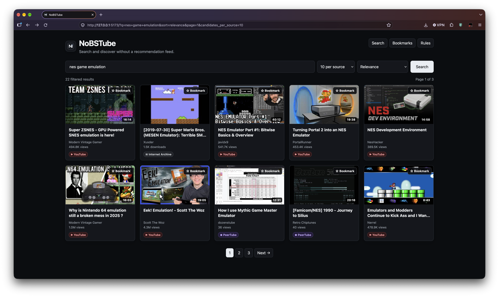

# NoBSTube

**A local, self-hosted video discovery engine that helps you find useful videos without relying on an algorithmic recommendation feed.**



NoBSTube searches multiple video sources, builds a local candidate pool, applies deterministic filtering, and uses a configurable LLM to identify videos that are relevant to what you actually searched for. Choose local Ollama or the OpenAI API.

The goal is simple:

> **Search for something. Get useful results. No recommendation feed required.**

---

## Why NoBSTube?

Most video platforms optimize for keeping you watching. Some video platforms show unwanted shock content. This AI filtered video search software bleaches out the bullsh*t.

NoBSTube is designed around a different workflow:

1. You explicitly search for something.
2. NoBSTube gathers candidates from multiple sources.
3. Obvious unwanted content is removed using deterministic rules.
4. Your selected LLM provider evaluates the remaining candidates for usefulness and relevance.
5. Results are ranked and cached locally.
6. Pagination and sorting happen against that cached result set rather than repeatedly searching the underlying services.

There is no personalized recommendation feed. Local Ollama works without a cloud AI account; you can optionally select the OpenAI API instead.

---

## Features

* 🔎 Search across multiple video sources
* 🧠 LLM classification using local [Ollama](https://ollama.com/) or the OpenAI API
* 🤖 Qwen support, with `qwen3:8b` as the current recommended model
* 🛡️ Deterministic hard-rejection rules before LLM classification
* 📦 Batched LLM classification
* ⚡ Bounded local concurrency
* 💾 In-memory search-result caching
* 📄 Pagination without repeating external searches
* ↕️ Client-side/server-side sorting of cached candidates
* 🌎 English-language preference without excluding other languages
* 🖼️ Source-provided thumbnails only
* ▶️ Embedded/direct playback where supported
* 🔗 External playback links when a source cannot be played inside NoBSTube
* 🌑 Dark mode by default
* ⏳ Visible search progress indicator
* 🛑 Search cancellation
* 📊 Video duration and view counts when supplied by the source
* 🏷️ Source badges for YouTube, PeerTube, and Internet Archive
* 🧪 Automated tests
* 🏠 Fully self-hosted when using local Ollama

---

## Supported sources

NoBSTube currently searches:

| Source           | Discovery | Playback                        |
| ---------------- | --------- | ------------------------------- |
| YouTube          | ✅         | Official embed                  |
| PeerTube         | ✅         | Direct playback where available |
| Internet Archive | ✅         | Direct playback where available |

Source behavior depends on the metadata and playback capabilities exposed by each service.

NoBSTube does **not** download or re-host video media for discovery.

---

## Architecture

A search builds a candidate pool once.

```text
                         ┌──────────────┐
                         │   YouTube    │
                         └──────┬───────┘
                                │
                         ┌──────▼───────┐
                         │   PeerTube   │
                         └──────┬───────┘
                                │
                         ┌──────▼──────────┐
                         │ Internet Archive│
                         └──────┬──────────┘
                                │
                                ▼
                         ┌──────────────┐
                         │ Deduplicate  │
                         └──────┬───────┘
                                │
                                ▼
                         ┌──────────────┐
                         │ Hard Rules   │
                         └──────┬───────┘
                                │
                                ▼
                         ┌──────────────┐
                         │ LLM Provider │
                         │  Classifier  │
                         └──────┬───────┘
                                │
                                ▼
                         ┌──────────────┐
                         │ Rank Results │
                         └──────┬───────┘
                                │
                                ▼
                         ┌──────────────┐
                         │ Local Cache  │
                         └──────┬───────┘
                                │
                     ┌──────────┴──────────┐
                     ▼                     ▼
                 Pagination             Sorting
```

Once the candidate pool has been built, changing pages or sorting does **not** trigger another search against YouTube, PeerTube, Internet Archive, or the selected LLM provider.

---

# Requirements

* Python 3.11+
* Node.js 20.19+ and npm for the Vue frontend
* macOS, Linux, or another platform capable of running the Python dependencies
* [Ollama](https://ollama.com/) and a compatible local model when using the local provider
* An OpenAI API key when using the OpenAI provider

The project is currently developed and tested primarily on a MacBook Air.

---

# Installation

Clone the repository:

```bash
git clone https://github.com/YOUR_USERNAME/nobstube.git
cd nobstube
```

Create a virtual environment:

```bash
python3 -m venv .venv
source .venv/bin/activate
```

Install dependencies:

```bash
pip install -r requirements.txt
```

---

# LLM provider setup

NoBSTube defaults to local Ollama, so you can keep using local inference without an API key.
Select the provider in `.env` with `AI_PROVIDER=ollama` or `AI_PROVIDER=openai`.

## Local Ollama

Install Ollama and pull the recommended model:

```bash
ollama pull qwen3:8b
```

Verify that Ollama is running:

```bash
ollama list
```

NoBSTube communicates with the local Ollama HTTP API.

Create your `.env` file:

```dotenv
OLLAMA_BASE_URL=http://localhost:11434
OLLAMA_MODEL=qwen3:8b
OLLAMA_ENABLED=true
AI_PROVIDER=ollama

OLLAMA_TIMEOUT=75
OLLAMA_BATCH_SIZE=16
OLLAMA_MAX_CONCURRENT=1
OLLAMA_NUM_PREDICT=1200
OLLAMA_DESCRIPTION_CHARS=650
OLLAMA_KEEP_ALIVE=10m
OLLAMA_THINK=false
```

These are starting points rather than universal optimal values.

On a MacBook Air, local inference speed depends heavily on available memory, model size, batch size, and whether other applications are competing for resources.

## OpenAI API

To send candidate metadata to OpenAI for classification, set these values in `.env`:

```dotenv
AI_PROVIDER=openai
OPENAI_API_KEY=your-api-key
OPENAI_MODEL=gpt-4o-mini
```

Keep the API key in the backend `.env` file; do not put it in frontend configuration or commit it to source control. OpenAI API usage may incur charges. When this provider is selected, the search query and each candidate's title, channel, description, and tags are sent to OpenAI. Hard-rejected candidates are filtered out before being sent.

OpenAI `429` errors can mean either a temporary rate limit or unavailable API quota. Temporary limits are retried automatically; if the error persists, lower `OLLAMA_MAX_CONCURRENT` or try again later. Quota errors are not retried: check the API account's billing and usage limits. ChatGPT subscriptions and API billing are managed separately.

Restart the API after changing provider settings. The two providers are alternatives: switching back to `AI_PROVIDER=ollama` restores local classification.

---

# Running NoBSTube

Start the API:

```bash
uvicorn api.main:app --reload
```

Start the UI in another terminal:

```bash
cd ui
npm install
npm run dev
```

Open `http://localhost:5173`. The API is available at `http://127.0.0.1:8000` and its interactive schema at `/docs`.

---

# Searching

Enter a search query and select how many candidates to request from each source.

Available candidate counts include:

* 10
* 25
* 50
* 75
* 100

For example:

```text
game development
```

NoBSTube might request:

```text
YouTube             100 candidates
PeerTube             100 candidates
Internet Archive     100 candidates
                     ───────────────
                     up to 300 candidates
```

The sources are queried concurrently.

Duplicate videos are removed before classification.

---

# LLM classification

After deterministic filtering, the remaining candidates are sent in batches to the selected provider: local Ollama or the OpenAI API.

For example:

```text
300 source candidates
        │
        ▼
hard rules
        │
        ├── 40 rejected
        │
        ▼
260 candidates
        │
        ▼
Selected provider
        │
        ▼
relevance classification
        │
        ▼
ranked results
```

The classifier considers information such as:

* title
* channel/creator
* description
* tags
* search query
* language

English-language content receives a small preference, but non-English content is **not automatically rejected**.

The LLM is used as a relevance/usefulness classifier rather than as a recommendation engine.

---

# Performance

LLM inference is normally the largest part of search time. Local Ollama performance depends on available hardware; OpenAI API performance depends on network latency and provider service.

The existing batch-size, concurrency, and timeout settings are:

```dotenv
OLLAMA_BATCH_SIZE=16
OLLAMA_MAX_CONCURRENT=1
OLLAMA_TIMEOUT=75
```

### Batch size

Larger batches reduce the number of HTTP requests but create larger prompts and responses. These settings also apply when using OpenAI, despite their existing `OLLAMA_` names.

If inference becomes unstable or slow:

```dotenv
OLLAMA_BATCH_SIZE=8
```

may work better.

### Concurrency

For local Ollama, running multiple generations simultaneously can make inference slower because they compete for the same memory and compute resources. For OpenAI, concurrency controls simultaneous API requests and may affect rate limits and cost.

Start with:

```dotenv
OLLAMA_MAX_CONCURRENT=1
```

and increase it only after measuring performance on your hardware.

---

# Search caching

NoBSTube caches the candidate/result set for a search.

This is important because it means pagination does not repeat expensive work.

For example:

```text
Search "game dev"
       │
       ▼
Build candidate pool
       │
       ▼
Classify candidates
       │
       ▼
Cache results
       │
       ├── Page 1
       ├── Page 2
       ├── Page 3
       └── Page 4
```

Moving between pages does not cause another source search.

Changing the sort order also operates on the cached candidates.

Changing the candidate count creates a different candidate search configuration.

The cache is local to the running NoBSTube process and expires after the configured cache period.

Restarting the application clears the in-memory cache.

---

# Search cancellation

Long local LLM searches can be cancelled from the UI.

Cancelling a search:

* stops the active search/classification work where possible (a request already sent to an external provider may not be cancellable there)
* removes the pending search from the active workflow
* clears the cached candidate set for that search
* leaves the previous displayed results intact

This prevents unwanted local classification work from continuing after the user has moved on.

---

# Sorting

Results can be sorted by:

* Relevance
* Newest
* Oldest
* Views: high → low
* Views: low → high
* Duration: short → long
* Duration: long → short

Sorting operates on the already-built candidate pool.

It does not trigger another source search.

---

# Playback

NoBSTube does not download or re-host videos simply to provide search results.

### YouTube

YouTube videos use the official embedded player where embedding is supported.

### PeerTube and Internet Archive

When source metadata exposes a playable media URL, NoBSTube can use the browser's native video player.

### Unsupported playback

If a video cannot be played inside NoBSTube, the watch interface provides a link to open the original video on its hosting site.

---

# Thumbnails

NoBSTube uses thumbnails supplied by the source.

It does not:

* generate replacement thumbnails
* download videos to create screenshots
* run ffmpeg for thumbnail generation
* create AI-generated thumbnails

This keeps discovery lightweight and avoids unnecessary media processing.

---

# Filtering rules

NoBSTube has two filtering layers.

### 1. Deterministic rules

Permanent exclusions are applied before a video reaches the selected LLM provider.

This avoids spending inference time or sending unnecessary metadata for content that can be rejected cheaply.

The application logs hard-rejection reasons so filtering behavior can be inspected and debugged.

### 2. Semantic classification

Remaining candidates are evaluated by the selected LLM provider.

The classifier considers whether a video is genuinely relevant to the user's query rather than simply matching a keyword.

This allows queries such as:

```text
game dev
```

to return substantive development/project content without requiring the title to look like a formal tutorial.

---

# YouTube discovery

NoBSTube uses `yt-dlp` for YouTube discovery rather than requiring a YouTube API account.

Discovery uses lightweight extraction where possible instead of fully processing every result.

If YouTube is slow or unavailable, the other sources can still return results.

---

# Configuration

The `.env` file controls the LLM provider and its settings.

Important settings include:

| Setting                    | Purpose                                          |
| -------------------------- | ------------------------------------------------ |
| `AI_PROVIDER`              | Select `ollama` (default) or `openai`            |
| `OLLAMA_ENABLED`           | Enable/disable local AI classification           |
| `OLLAMA_BASE_URL`          | Ollama server address                            |
| `OLLAMA_MODEL`             | Ollama model name                                |
| `OLLAMA_TIMEOUT`           | Maximum request time                             |
| `OLLAMA_BATCH_SIZE`        | Videos sent per classification request           |
| `OLLAMA_MAX_CONCURRENT`    | Number of simultaneous Ollama requests           |
| `OLLAMA_NUM_PREDICT`       | Maximum generated tokens                         |
| `OLLAMA_DESCRIPTION_CHARS` | Description length sent to the selected provider |
| `OLLAMA_KEEP_ALIVE`        | Keep model loaded between requests               |
| `OLLAMA_THINK`             | Enable/disable Qwen reasoning for classification |
| `OPENAI_API_KEY`           | API key used only by the backend OpenAI client   |
| `OPENAI_MODEL`             | OpenAI model name (default: `gpt-4o-mini`)       |
| `OPENAI_BASE_URL`          | OpenAI API base URL                              |

See `.env.example` for the complete configuration.

---

# Development

Run the test suite:

```bash
PYTHONPATH=. pytest -q
```

Start the API and UI separately during development:

```bash
uvicorn api.main:app --reload
```

In a second terminal:

```bash
cd ui
npm install
npm run dev
```

The Vue development server runs at `http://localhost:5173` and proxies `/api` to `http://127.0.0.1:8000`. Set `VITE_API_PROXY` when the API is at another address. For a separately hosted production UI, set `VITE_API_BASE_URL` before building it to the API origin, and set the API's comma-separated `CORS_ORIGINS` to the UI origin(s). The API listens on port 8000 and exposes its OpenAPI schema at `/docs`.

---

# Project structure

```text
nobstube/
├── api/
│   ├── filtering/
│   │   ├── classifier.py
│   │   ├── ollama.py
│   │   ├── pipeline.py
│   │   └── rules.py
│   ├── sources/
│   │   ├── youtube.py
│   │   ├── peertube.py
│   │   └── archive.py
│   ├── database.py
│   ├── config.py
│   └── main.py
├── ui/
│   ├── src/
│   ├── package.json
│   └── vite.config.ts
├── config/
│   └── rules.yaml
├── tests/
├── .env.example
├── requirements.txt
└── README.md
```

---

# Privacy

NoBSTube can run fully locally with Ollama, or use a hosted AI provider if you choose.

By default, classification uses your local Ollama installation. If you choose `AI_PROVIDER=openai`, NoBSTube sends the query and metadata for candidates that pass hard rules to the OpenAI API.

Searches do contact the external video services required to obtain search results.

The application does not need a cloud AI account when using local Ollama. OpenAI API requests require an API key and may incur charges.

---

# Current limitations

NoBSTube is intentionally lightweight and has some limitations:

* Local LLM inference can be slow on lower-powered hardware.
* Search quality depends partly on the metadata supplied by each source.
* Some videos cannot be embedded because the hosting service or creator does not permit embedding.
* Source APIs and search behavior can change.
* YouTube discovery through `yt-dlp` may occasionally be affected by changes on YouTube.
* The current cache is process-local rather than a distributed cache.
